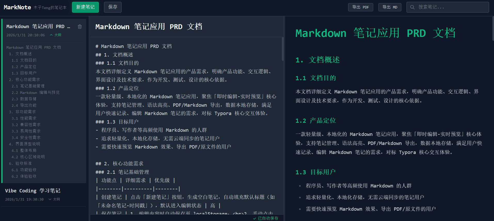

# MarkNote - 极客风格 Markdown 笔记应用

MarkNote 是一款专为开发者和写作爱好者打造的轻量级、高性能 Markdown 笔记应用。采用现代化的 Geek 风格设计（Emerald Green 主题），集成了实时预览、大纲导航、多格式导出等核心功能，致力于提供流畅、专注的写作体验。



## ✨ 核心特性

- **极客 UI 设计**：深色模式基调搭配 Emerald Green 点缀，护眼且专注。
- **三栏响应式布局**：侧边栏、编辑器、预览区宽度可自由拖拽调整，自动适应不同屏幕。
- **所见即所得**：左侧编辑，右侧实时渲染，支持 Tailwind Typography 美化的排版样式。
- **智能大纲导航**：
  - 自动提取 Markdown 标题生成大纲。
  - 支持双向精准跳转：点击大纲精准定位到编辑器和预览区的对应位置。
  - 侧边栏折叠式大纲，不占用额外空间。
- **强大的编辑体验**：
  - 支持手动代码块闭合，无干扰的输入体验。
  - 代码高亮（Highlight.js）。
  - 支持列表、链接、图片、换行等标准 Markdown 语法。
- **数据安全与导出**：
  - **自动保存**：编辑过程中自动保存草稿，防抖设计避免频繁写入。
  - **多格式导出**：支持导出为 Markdown (.md) 和 PDF 文件。
  - **原生文件系统集成**：支持自定义导出路径（File System Access API）。

## 🛠️ 技术栈

本项目采用当前最前沿的前端技术栈构建：

- **核心框架**: [Vue 3](https://vuejs.org/) (Composition API, Script Setup)
- **构建工具**: [Vite](https://vitejs.dev/)
- **开发语言**: [TypeScript](https://www.typescriptlang.org/)
- **样式方案**: [Tailwind CSS](https://tailwindcss.com/)
- **Markdown 引擎**: 
  - [Marked](https://marked.js.org/) (解析器)
  - [Highlight.js](https://highlightjs.org/) (代码高亮)
  - [Tailwind Typography](https://github.com/tailwindlabs/tailwindcss-typography) (排版美化)
- **状态管理**: Vue Reactivity System (Composition API store pattern)
- **工具库**: Lodash-es (防抖等工具函数)

## 🚀 快速开始

### 环境要求

- Node.js >= 16.0.0
- npm 或 yarn / pnpm

### 安装步骤

1. **克隆仓库**

   ```bash
   git clone https://github.com/yourusername/markdown-notes.git
   cd markdown-notes
   ```

2. **安装依赖**

   ```bash
   npm install
   # 或者
   yarn install
   # 或者
   pnpm install
   ```

3. **启动开发服务器**

   ```bash
   npm run dev
   ```

   访问 `http://localhost:5173` 即可开始使用。

### 构建生产版本

```bash
npm run build
```

构建产物将输出到 `dist` 目录。

## 📝 使用指南

1. **创建笔记**：点击顶部导航栏的“新建笔记”按钮。
2. **编辑内容**：在中间编辑区输入 Markdown 文本，支持快捷键（如 Ctrl+B 加粗，Ctrl+I 斜体）。
3. **查看大纲**：在左侧笔记列表的卡片左下方，点击“大纲”按钮展开当前笔记的目录结构。
4. **导出笔记**：点击右上角的“导出 PDF”或“导出 MD”按钮，选择保存位置即可。
5. **调整布局**：鼠标悬停在栏目分割线上，拖动即可调整侧边栏或预览区的宽度。

## 📄 许可证

本项目基于 MIT 许可证开源。详情请参阅 [LICENSE](LICENSE) 文件。
